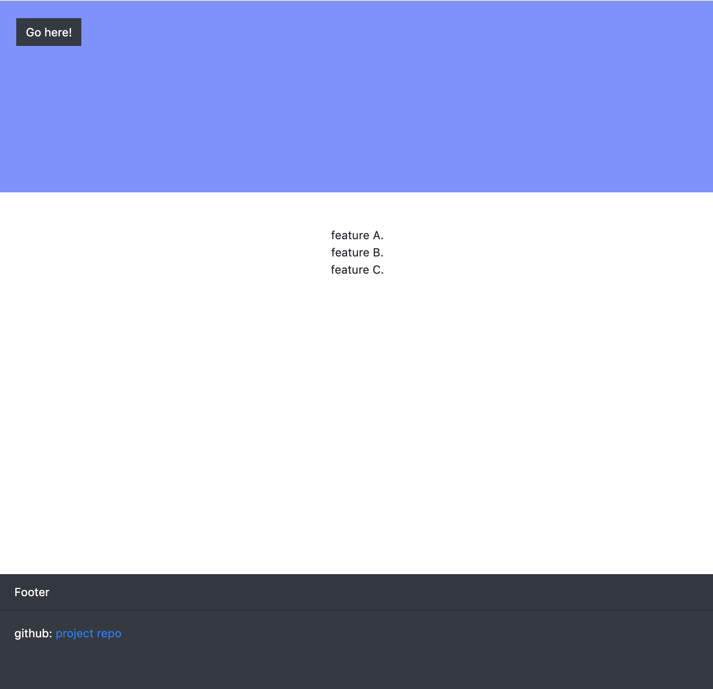
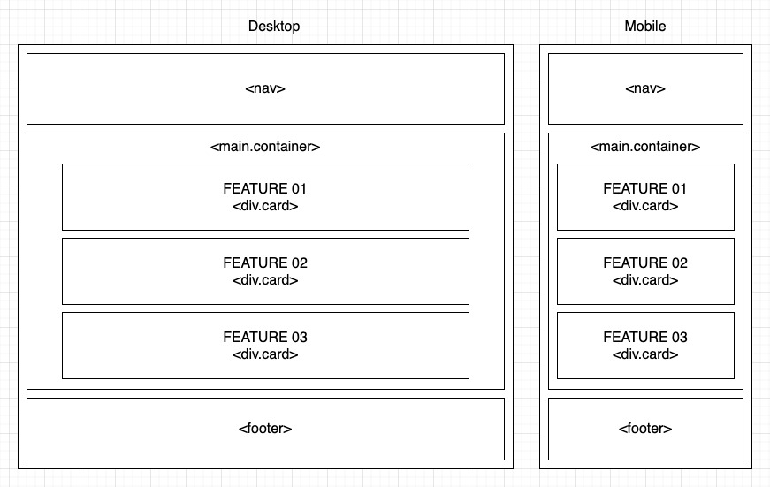

# project01-boilerplate 🚀
A boilerplate suggestion for project01

## 🌎 [Live](https://ronerlih.github.io/project01-boilerplate/)  (github pages)

## why?

> To have a suggested scuffolding for a clear seperation of code between the team members for agile development.

## How to use
Either use as a reference, recreate from sratch, copy the files, fork, or clone the repo.

## Layout


#### Wireframe


#### Suggested file structure
```sh
.
├── README.md # 📖
├── assets # for the app and project management 
│   ├── images
│   │   ├── features.png
│   │   ├── mockup.png
│   │   ├── wireframe.drawio
│   │   └── wireframe.jpg
│   ├── scripts
│   │   ├── scriptA.js
│   │   └── scriptB.js
│   └── styles
│       └── style.css
└── index.html # landing page
```
#### Suggested feature-task seperation


#### Helpful links:
- **Readme suggestion**: https://columbia.bootcampcontent.com/columbia-bootcamp/cu-nyc-virt-fsf-pt-03-2021-u-c/-/blob/master/07-Project-1/06-Class-Notes/good-readme-guide.md

- **Project 01 prep**: https://columbia.bootcampcontent.com/columbia-bootcamp/cu-nyc-virt-fsf-pt-03-2021-u-c/-/blob/master/07-Project-1/06-Class-Notes/project-01-prep.md

- **project week (07)**: https://columbia.bootcampcontent.com/columbia-bootcamp/cu-nyc-virt-fsf-pt-03-2021-u-c/-/tree/master/07-Project-1

- **git branching**: https://git-scm.com/book/en/v2/Git-Branching-Branching-Workflows

* 🌟 Create and protect repo instructions:
    * **Repo setup:** https://columbia.bootcampcontent.com/columbia-bootcamp/cu-nyc-virt-fsf-pt-03-2021-u-c/-/tree/master/06-Server-Side-APIs/01-Activities/25-Stu_Git-Repo-Setup
    * **Invite collaborators:** https://columbia.bootcampcontent.com/columbia-bootcamp/cu-nyc-virt-fsf-pt-03-2021-u-c/-/tree/master/06-Server-Side-APIs/01-Activities/25-Stu_Git-Repo-Setup

# 🏂 Good luck!! 🏂
