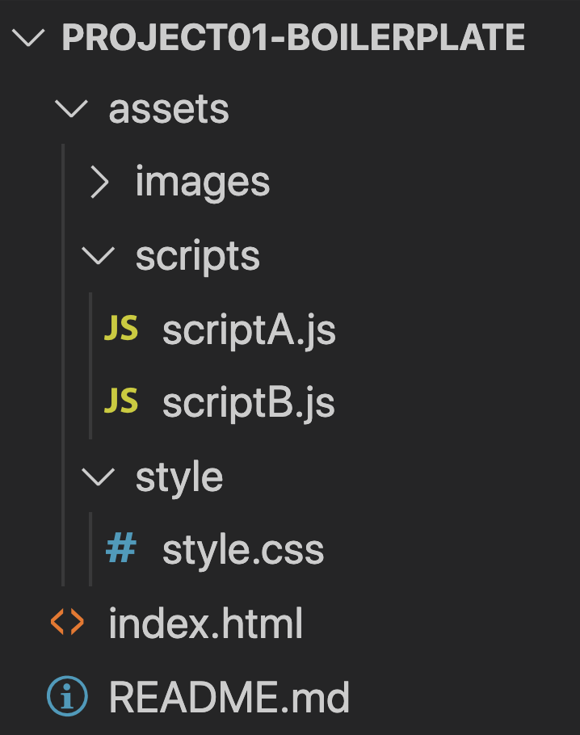

# project01-boilerplate 🚀
A boilerplate suggestion for project01

#### why?

> To have a suggested scuffolding for a clear seperation of code between the team members for agile development.

#### How to use
Either recreate from sratch, copy the files, fork, or clone the repo.

#### visual
[Demo]()

#### Wireframe

#### Suggested file structure

#### Suggested feature-task seperation

#### Helpful links:
- Readme suggestion: https://columbia.bootcampcontent.com/columbia-bootcamp/cu-nyc-fsf-pt-07-2020-u-c/tree/master/01-HTML-Git-CSS/04-Supplemental/Good-README-Guide
- Project 01 prep: https://columbia.bootcampcontent.com/columbia-bootcamp/cu-nyc-fsf-pt-07-2020-u-c/blob/master/06-Server-Side-APIs/project-01-prep.md

- project week (07): https://columbia.bootcampcontent.com/columbia-bootcamp/cu-nyc-fsf-pt-07-2020-u-c/tree/master/07-Project-1

- git branching: https://git-scm.com/book/en/v2/Git-Branching-Branching-Workflows

# 🏂 Good luck!! 🏂
